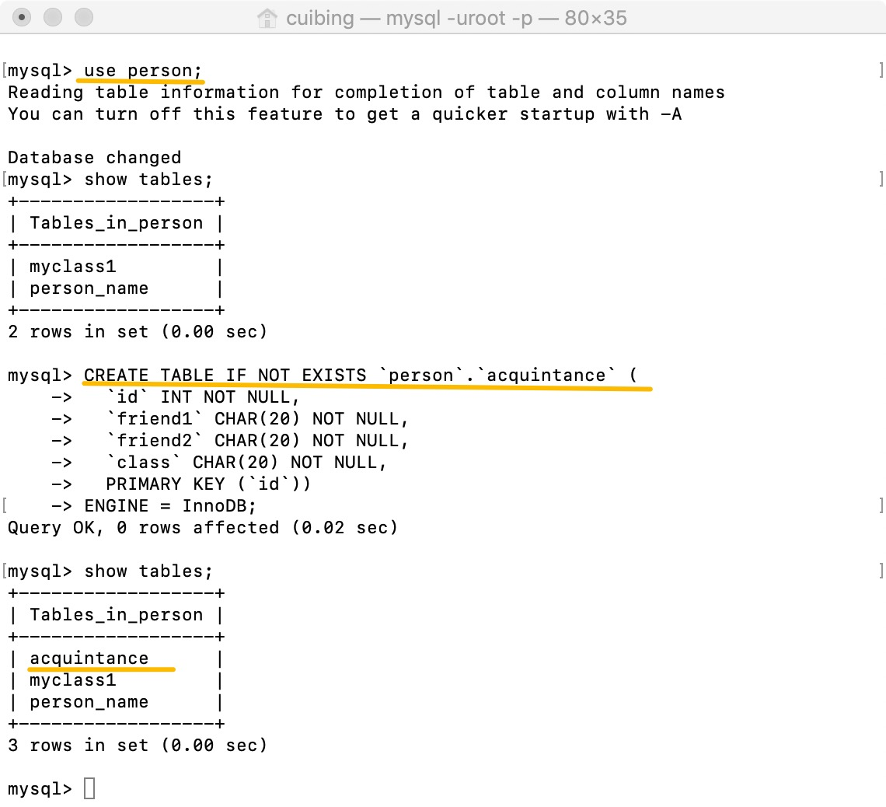
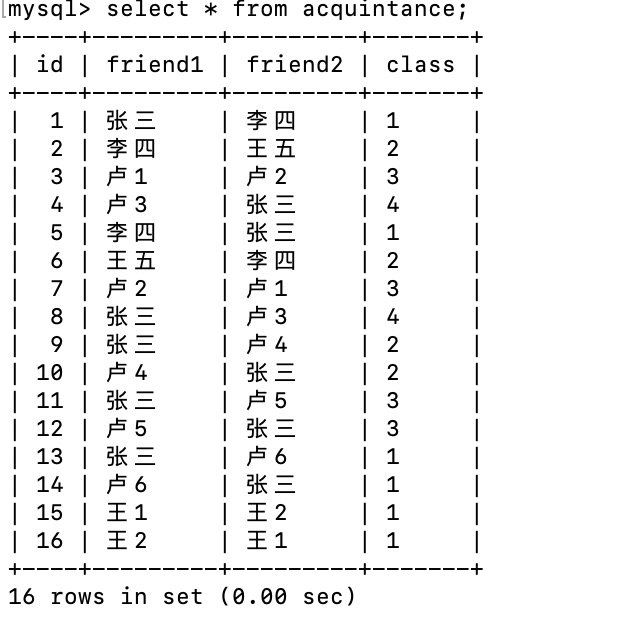
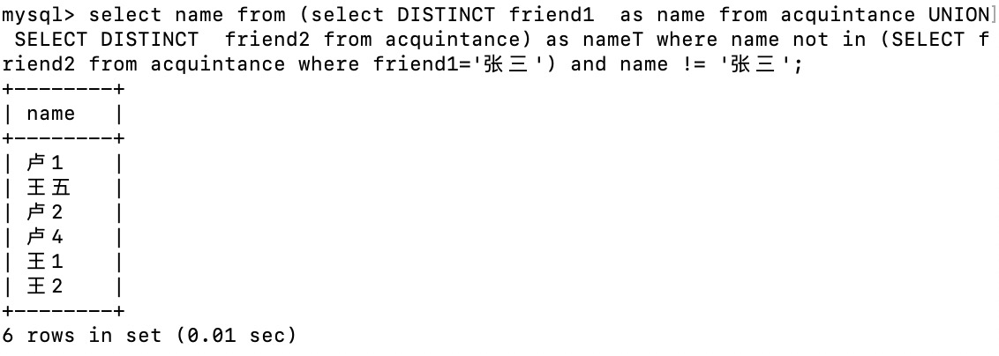
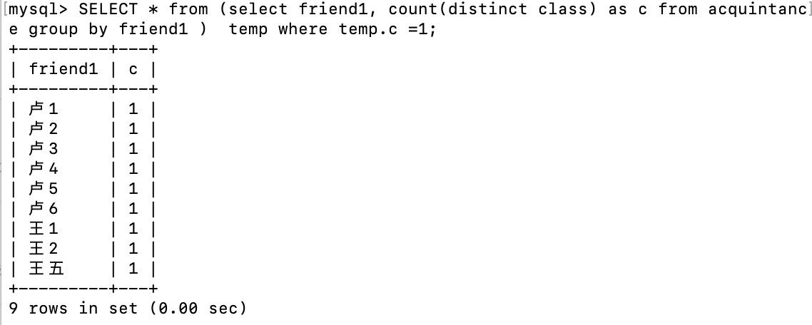
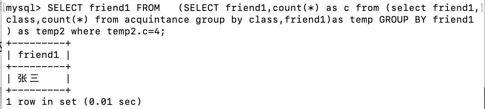
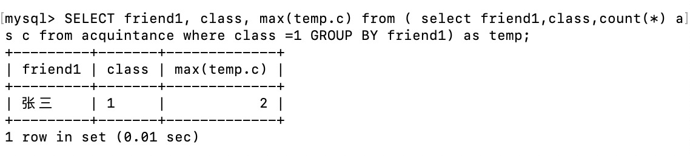

#### 题目一：

1. 请写出该表的定义语句。

   `CREATE TABLE IF NOT EXISTS person.acquintance (`
     `id INT NOT NULL,`
     `friend1 CHAR(20) NOT NULL,`
     `friend2 CHAR(20) NOT NULL,`
     `class CHAR(20) NOT NULL,`
     `PRIMARY KEY (id))`
   `ENGINE = InnoDB;`

2. 在MySQL数据库新建此表。

   

3. 生成测试数据

   工具：http://www.generatedata.com

   代码：

   DROP TABLE `acquintance`;

   `CREATE TABLE acquintance (`
     `id mediumint(8) unsigned NOT NULL auto_increment,`
     `friend1 varchar(255) default NULL,`
     `friend2 varchar(255) default NULL,`
     `class mediumint default NULL,`
     `PRIMARY KEY (id)`
   `) AUTO_INCREMENT=1;`

   `INSERT INTO acquintance (friend1,friend2,class) VALUES ("Rogan","Price",1),("Rooney","Hamish",2),("Ivan","Lance",4),("Yuli","Fulton",3),("Raja","Damian",4),("Barclay","Nero",3),("Fuller","Avram",2),("Quamar","Carson",1),("Omar","Gage",4),("Rigel","Amal",1);`
   `INSERT INTO acquintance (friend1,friend2,class) VALUES ("Seth","Flynn",3),("August","Hop",4),("Zeus","Walter",3),("Galvin","Lev",4),("Merrill","Blaze",1),("Christian","Hasad",3),("Kennan","Sean",3),("Merritt","Oren",3),("Caldwell","Thomas",4),("Oleg","Brent",3);`
   `INSERT INTO acquintance (friend1,friend2,class) VALUES ("Rudyard","Jason",3),("Herrod","Harrison",1),("Nissim","Abdul",4),("Dustin","Vladimir",3),("Perry","Jordan",1),("Forrest","Demetrius",3),("Ethan","Brock",3),("Oscar","Lamar",1),("Alan","Shad",3),("Zeph","Dante",3);`
   `INSERT INTO acquintance (friend1,friend2,class) VALUES ("Edward","Hyatt",1),("Caesar","Driscoll",1),("Grady","Jeremy",2),("Jordan","Rigel",3),("Marshall","Lawrence",4),("Lars","Joseph",3),("Bruno","Felix",4),("Addison","Raphael",2),("Kuame","Ivan",4),("Tarik","Aidan",2);`
   `INSERT INTO acquintance (friend1,friend2,class) VALUES ("Samuel","Darius",2),("Nasim","Hedley",1),("Amos","Cole",2),("Merritt","Erasmus",2),("Rigel","Fletcher",3),("Avram","Hunter",1),("Ezekiel","Valentine",1),("Hayes","Davis",1),("Harlan","Jerry",2),("Ryan","Zeus",4);`
   `INSERT INTO acquintance (friend1,friend2,class) VALUES ("Lester","Brian",1),("Guy","Micah",2),("Kieran","Victor",4),("Deacon","Wallace",2),("Oscar","Beck",3),("Merritt","Deacon",2),("Mark","Kadeem",3),("Russell","Stewart",1),("Hammett","Kasper",1),("Adrian","Ira",3);`
   `INSERT INTO acquintance (friend1,friend2,class) VALUES ("Thane","Lev",1),("Simon","Anthony",2),("Gary","Ira",1),("Harding","Rashad",4),("Ian","Cody",3),("Colin","Lionel",3),("Paki","Nigel",2),("Chandler","Malik",3),("Bruno","Alan",1),("Edan","Marshall",1);`
   `INSERT INTO acquintance (friend1,friend2,class) VALUES ("Solomon","Buckminster",1),("Jin","Cameron",2),("Lyle","Patrick",4),("Mohammad","Giacomo",2),("Jameson","Lucas",2),("Ahmed","Colt",3),("Slade","Yardley",1),("Guy","Colby",2),("Kevin","Lance",1),("Jermaine","Wayne",1);`
   `INSERT INTO acquintance (friend1,friend2,class) VALUES ("Eagan","Rudyard",4),("John","Neil",1),("Buckminster","Isaac",4),("Merrill","Louis",1),("Andrew","Hayes",4),("Kenneth","Brock",4),("Burton","Nash",4),("Burton","Arden",3),("Mason","Merritt",3),("August","Basil",1);`
   `INSERT INTO acquintance (friend1,friend2,class) VALUES ("Maxwell","Damon",1),("Colin","Deacon",3),("Wing","James",1),("Roth","Reuben",2),("Hu","Seth",4),("Kamal","Keaton",2),("Gareth","Ashton",3),("Nicholas","Elijah",2),("Dustin","Nero",4),("Dalton","Hoyt",4);`

   结果：生成100条数据，其中“class”列用1、2、3、4来表示四种类别。

   

   此处为了方便测试，换了一个相对简单的测试数据。

   

#### 题目二：

老师抱歉，以下题目我绞尽脑汁也只能做到这个程度了。这题对我来说实在是太难了，不太会做，希望老师能详细讲讲。

1. 找出互不认识的人

   `select name from (select DISTINCT friend1 as name from acquintance UNION SELECT DISTINCT friend2 from acquintance) as nameT where name not in (SELECT friend2 from acquintance where friend1='张三') and name != '张三';`

   只能实现求某人的非好友。（只能做到这个程度了）

   

2. 找出只在一个类别里出现的人

   `SELECT * from (select friend1, count(distinct class) as c from acquintance group by friend1 ) as temp where temp.c =1;`

3. 找出在所有类别里都有朋友的人

   `SELECT friend1 FROM  (SELECT friend1,count(*) as c from (select friend1,class,count(*) from acquintance group by class,friend1)as temp GROUP BY friend1 ) as temp2 where temp2.c=4;`

4. 找出在同一类别通过朋友结识的其他朋友

   `SELECT friend1,class,max(temp.c) from ( select friend1,class,count(*) as c from acquintance where class =1 GROUP BY friend1) as temp;`

把class=1替换成其他的值就可以了