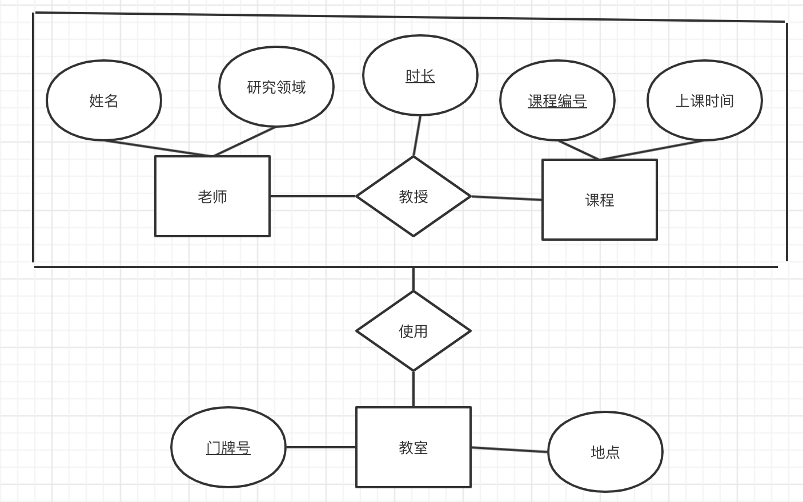
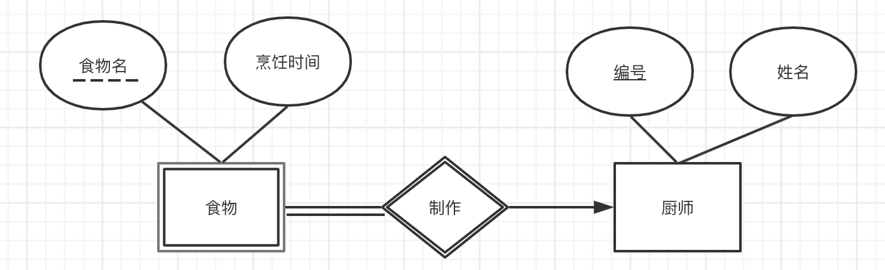
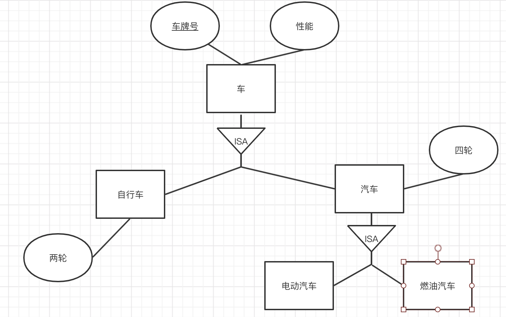
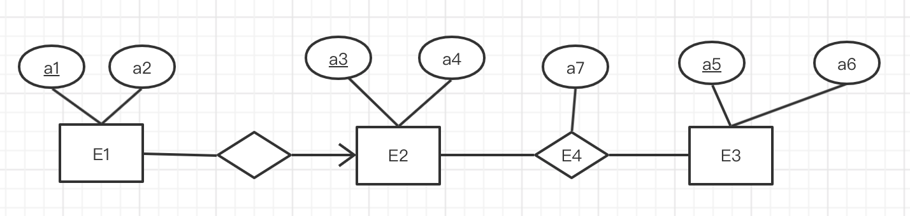
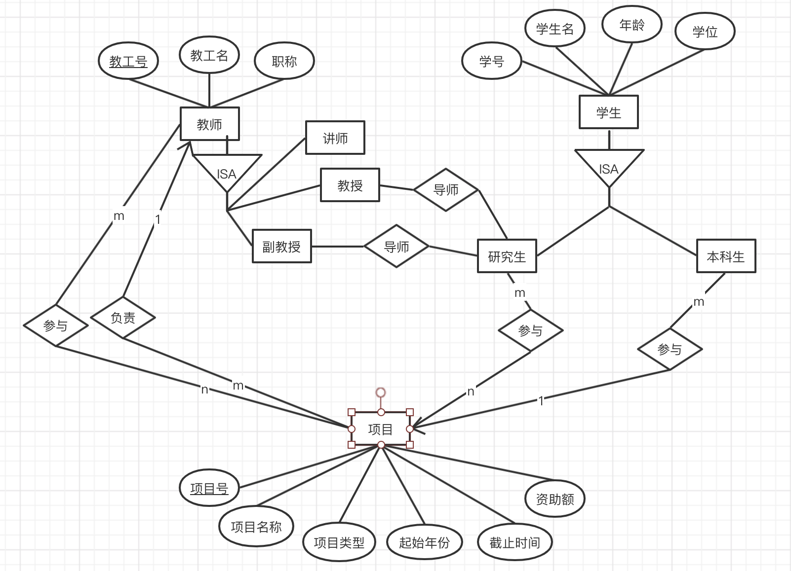
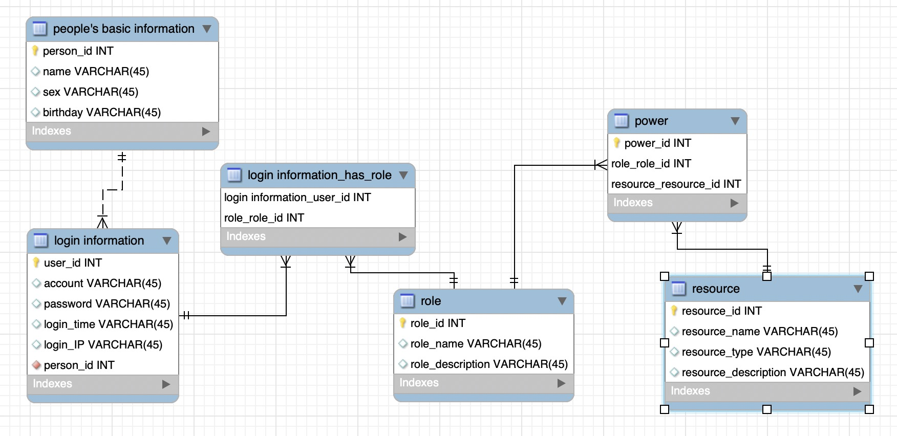

## 题目一

##### 1. 什么是正向工程？什么是逆向工程？

正向工程是通过到实现语言的映射而把模型转换为代码的过程。

如：CDM --> PDM --> Database

逆向工程是通过从特定实现语言的映射而把代码转换为模型的过程。

如：Database --> PDM --> CDM

（PDM：物理数据模型，CDM：概念数据模型）

##### 2. 列举聚集、弱实体、细化/泛化的实用例子。

**聚集：**

老师教授课程并使用教室--老师、课程和教授复合成一个实体集，与教室发生联系

**弱实体：**

厨师：强实体集，主码是编号，含有姓名属性。
食物 ：弱实体集，分辨符是食物名，含有姓名属性
制作：联系集，哪个厨师做了哪个食物

**细化/泛化：**

3. ##### 已知有如下关系模式：E1(_a1, a2, a3)，E2(_a3, a4)， E3(_a5, a6)， E4(_a3, _a5, a7)，其中带下划线的属性标识为所在关系模式的主码。试画出相应的E-R图，使得可以从该E-R图推导出上述关系模式。

## 题目二

## 题目三

