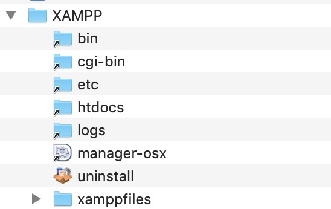
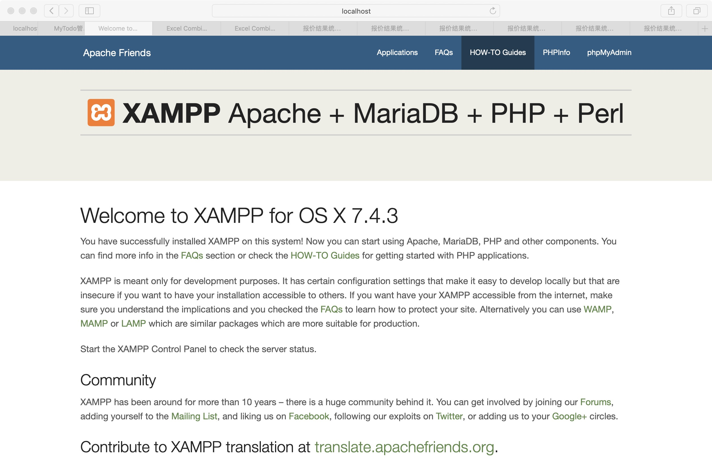

题目一：

Apache/Nginx + MySQL + PHP基础开发环境的准备工作





题目二：

复习并练习使用编程语言访问数据库

```php
<?php

$conn = mysqli_connect("localhost", "root", "") or die("连接数据库失败" . mysqli_error($conn));

mysqli_select_db($conn, "todolist") or die("选择数据库失败" . mysqli_error($conn));

mysqli_query($conn, "set names utf8");

?>
```

