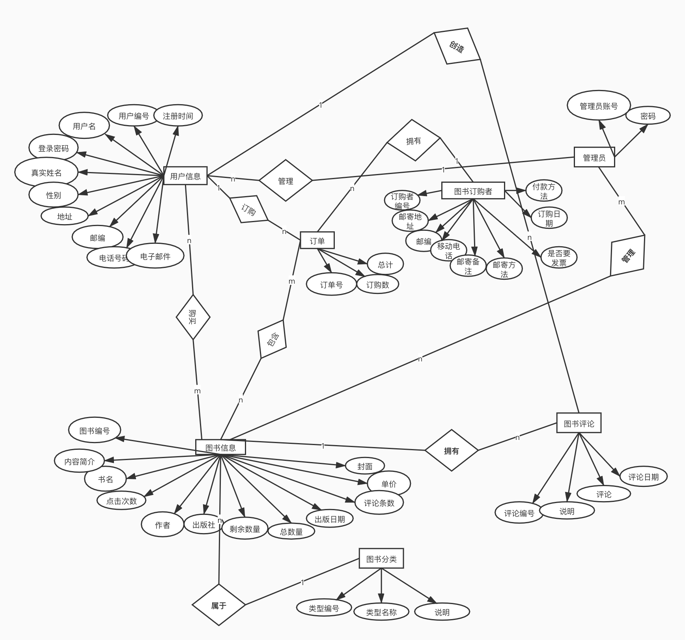
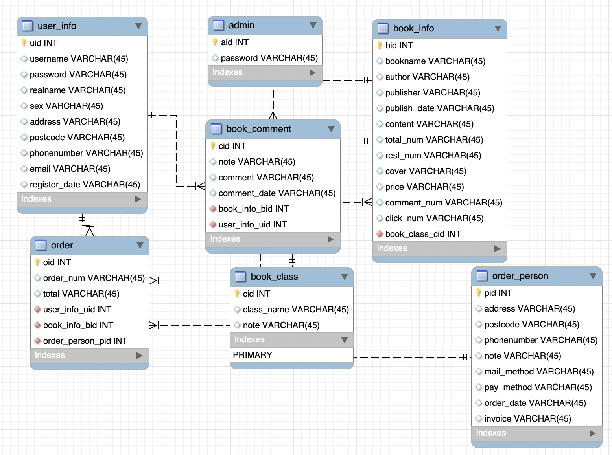

## 数据库设计案例分析一

#### 概念设计




注：processon导出的图没有将主键下划线显示出来。上图中，所有实体集的”xx编号“都是主键。（下列带下划线的属性都是主键）

- 用户信息实体集。其属性有:<u>用户编号</u>,用户名,登录密码,真实姓名,性别,地址邮编,电话号码,电子邮件,注册时间。
- 管理员实体集。其属性有:<u>管理员账号</u>,密码。
- 图书信息实体集。其属性有:<u>图书编号</u>,书名,类型编号,作者,出版社,出版日期,内容简介,总数量,剩余数量,封面,单价,评论条数,点击次数。
- 图书评论实体集。其属性有:<u>评论编号</u>,图书编号,说明,评论,用户编号,评论 日期
- 订单实体集。其属性有:用户编号,<u>订单号,</u>书号,订购数,总计,订购者编号。
- 图书分类实体。其属性有:<u>类型编号</u>,类别名称,说明。
- 图书订购者详情实体集。其属性有:<u>订购者编号</u>,邮寄地址,邮编,移动电话,邮寄 备注,邮寄方法,付款方法,订购日期,是否要发票。


#### 逻辑设计与物理实施



workbench导出SQL：

```mysql
CREATE TABLE IF NOT EXISTS `mydb`.`user_info` (
  `uid` INT NOT NULL,
  `username` VARCHAR(45) NULL,
  `password` VARCHAR(45) NULL,
  `realname` VARCHAR(45) NULL,
  `sex` VARCHAR(45) NULL,
  `address` VARCHAR(45) NULL,
  `postcode` VARCHAR(45) NULL,
  `phonenumber` VARCHAR(45) NULL,
  `email` VARCHAR(45) NULL,
  `register_date` VARCHAR(45) NULL,
  PRIMARY KEY (`uid`))
ENGINE = InnoDB

CREATE TABLE IF NOT EXISTS `mydb`.`book_comment` (
  `cid` INT NOT NULL,
  `note` VARCHAR(45) NULL,
  `comment` VARCHAR(45) NULL,
  `comment_date` VARCHAR(45) NULL,
  `book_info_bid` INT NOT NULL,
  `user_info_uid` INT NOT NULL,
  PRIMARY KEY (`cid`),
  INDEX `fk_book_comment_book_info1_idx` (`book_info_bid` ASC) VISIBLE,
  INDEX `fk_book_comment_user_info1_idx` (`user_info_uid` ASC) VISIBLE,
  CONSTRAINT `fk_book_comment_book_info1`
    FOREIGN KEY (`book_info_bid`)
    REFERENCES `mydb`.`book_info` (`bid`)
    ON DELETE NO ACTION
    ON UPDATE NO ACTION,
  CONSTRAINT `fk_book_comment_user_info1`
    FOREIGN KEY (`user_info_uid`)
    REFERENCES `mydb`.`user_info` (`uid`)
    ON DELETE NO ACTION
    ON UPDATE NO ACTION)
ENGINE = InnoDB

CREATE TABLE IF NOT EXISTS `mydb`.`book_info` (
  `bid` INT NOT NULL,
  `bookname` VARCHAR(45) NULL,
  `author` VARCHAR(45) NULL,
  `publisher` VARCHAR(45) NULL,
  `publish_date` VARCHAR(45) NULL,
  `content` VARCHAR(45) NULL,
  `total_num` VARCHAR(45) NULL,
  `rest_num` VARCHAR(45) NULL,
  `cover` VARCHAR(45) NULL,
  `price` VARCHAR(45) NULL,
  `comment_num` VARCHAR(45) NULL,
  `click_num` VARCHAR(45) NULL,
  `book_class_cid` INT NOT NULL,
  PRIMARY KEY (`bid`),
  INDEX `fk_book_info_book_class_idx` (`book_class_cid` ASC) VISIBLE,
  CONSTRAINT `fk_book_info_book_class`
    FOREIGN KEY (`book_class_cid`)
    REFERENCES `mydb`.`book_class` (`cid`)
    ON DELETE NO ACTION
    ON UPDATE NO ACTION)
ENGINE = InnoDB

CREATE TABLE IF NOT EXISTS `mydb`.`order` (
  `oid` INT NOT NULL,
  `order_num` VARCHAR(45) NULL,
  `total` VARCHAR(45) NULL,
  `user_info_uid` INT NOT NULL,
  `book_info_bid` INT NOT NULL,
  `order_person_pid` INT NOT NULL,
  PRIMARY KEY (`oid`),
  INDEX `fk_order_user_info1_idx` (`user_info_uid` ASC) VISIBLE,
  INDEX `fk_order_book_info1_idx` (`book_info_bid` ASC) VISIBLE,
  INDEX `fk_order_order_person1_idx` (`order_person_pid` ASC) VISIBLE,
  CONSTRAINT `fk_order_user_info1`
    FOREIGN KEY (`user_info_uid`)
    REFERENCES `mydb`.`user_info` (`uid`)
    ON DELETE NO ACTION
    ON UPDATE NO ACTION,
  CONSTRAINT `fk_order_book_info1`
    FOREIGN KEY (`book_info_bid`)
    REFERENCES `mydb`.`book_info` (`bid`)
    ON DELETE NO ACTION
    ON UPDATE NO ACTION,
  CONSTRAINT `fk_order_order_person1`
    FOREIGN KEY (`order_person_pid`)
    REFERENCES `mydb`.`order_person` (`pid`)
    ON DELETE NO ACTION
    ON UPDATE NO ACTION)
ENGINE = InnoDB

CREATE TABLE IF NOT EXISTS `mydb`.`book_class` (
  `cid` INT NOT NULL,
  `class_name` VARCHAR(45) NULL,
  `note` VARCHAR(45) NULL,
  PRIMARY KEY (`cid`))
ENGINE = InnoDB

CREATE TABLE IF NOT EXISTS `mydb`.`order_person` (
  `pid` INT NOT NULL,
  `address` VARCHAR(45) NULL,
  `postcode` VARCHAR(45) NULL,
  `phonenumber` VARCHAR(45) NULL,
  `note` VARCHAR(45) NULL,
  `mail_method` VARCHAR(45) NULL,
  `pay_method` VARCHAR(45) NULL,
  `order_date` VARCHAR(45) NULL,
  `invoice` VARCHAR(45) NULL,
  PRIMARY KEY (`pid`))
ENGINE = InnoDB
CREATE TABLE IF NOT EXISTS `mydb`.`admin` (
  `aid` INT NOT NULL,
  `password` VARCHAR(45) NULL,
  PRIMARY KEY (`aid`))
ENGINE = InnoDB
```

