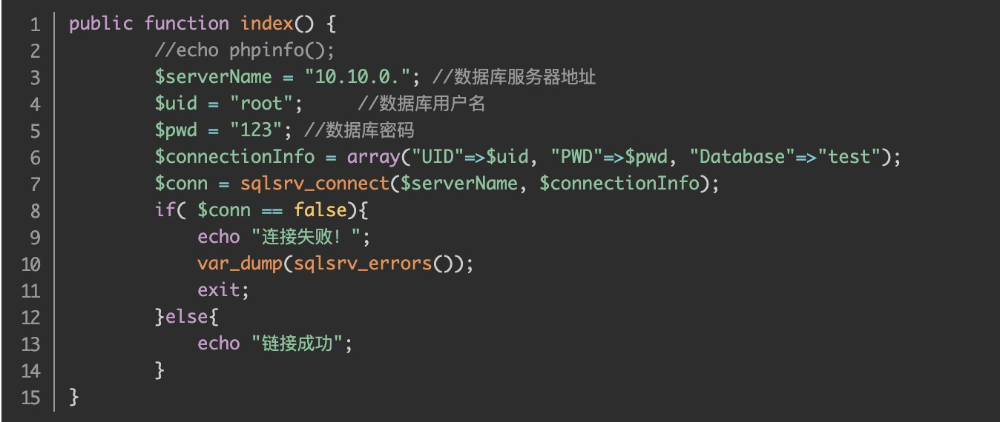

#### 题目0

##### 使用php连接mysql方法1

```php
<?php
$dbhost = 'localhost:3306';  //mysql服务器主机地址
$dbuser = 'root';      //mysql用户名
$dbpass = '';//mysql用户名密码
$conn = mysql_connect($dbhost, $dbuser, $dbpass);
if(! $conn )
   {
	 die('Could not connect: ' . mysql_error());
   }
   mysql_select_db( 'makeup' );
   $sql = 'SELECT * 
              FROM mk';
   
   
   mysql_query("set names 'utf8'");
   $huoqu = mysql_query( $sql, $conn );
   if(! $huoqu )
	{
	die('Could not get data: ' . mysql_error());
	}

	while($row = mysql_fetch_array($huoqu, MYSQL_ASSOC))
	{
		    echo "<tr>";
            echo "<td>".$row['English']."</td>";
            echo "<td>".$row['Chinese']."</td>";
			echo "<td>".$row['source']."</td>";
            echo "</tr>";
		  
} 

	//echo "成功加载所有数据\n";
   mysql_close($conn);
?>
```


##### 使用pgp连接mysql方法2

```php
//连接数据库方式1
$conn = new mysqli('localhost', 'root', 'password', 'test');
//check connection (检查PHP是否连接上MYSQL)
if ($conn -> connect_errno) {

  printf("Connect failed: %s\n", $conn->connect_error);
  exit();
}

//查询代码
$sql = “select * from db_table”;
$query = $conn->query($sql);
while($row = $query->fetch_array()){
  echo $row['title'];
}


//释放结果集+关闭MySQL连接
$query1 -> free_result();
$conn -> close();
```


##### 使用php连接sql server

1. 下载sql server驱动。

2. 把两个ts.dll放到php/ext里。

3. 安装ODBC Driver for SQL Server 。

4. 在php.ini找个位置添加两行代码（dll文件的前缀即可），不用加后缀名
   extension=php_pdo_sqlsrv_72_ts_64
   extension=php_sqlsrv_72_ts_64

   测试下是否可以连接

   
   
   