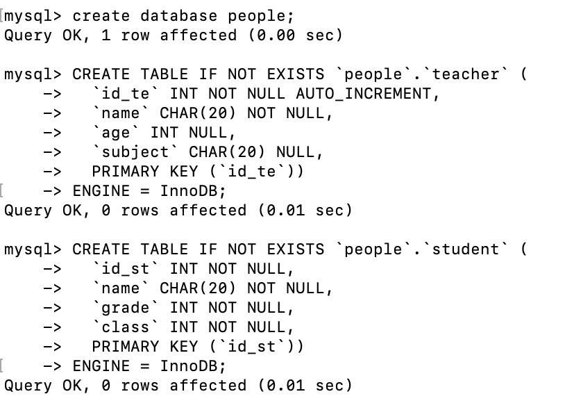
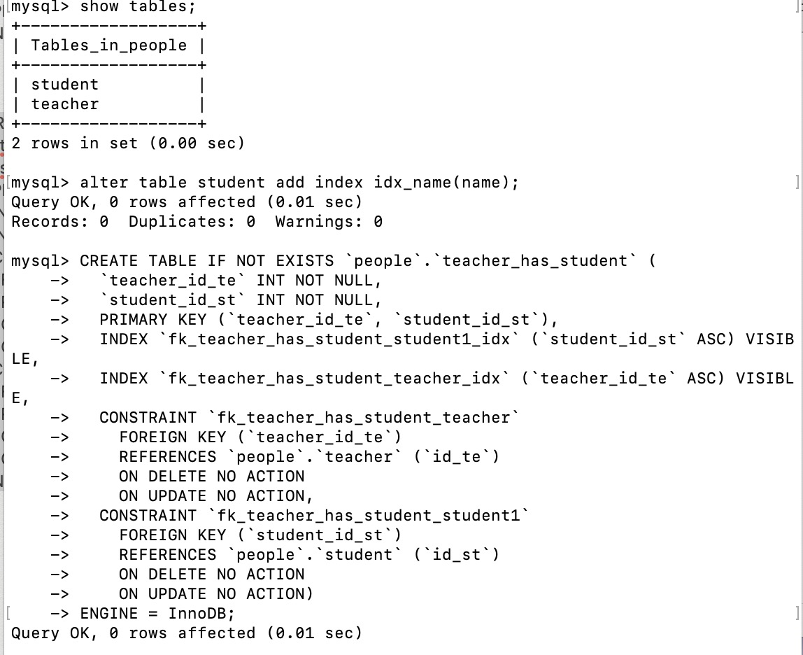
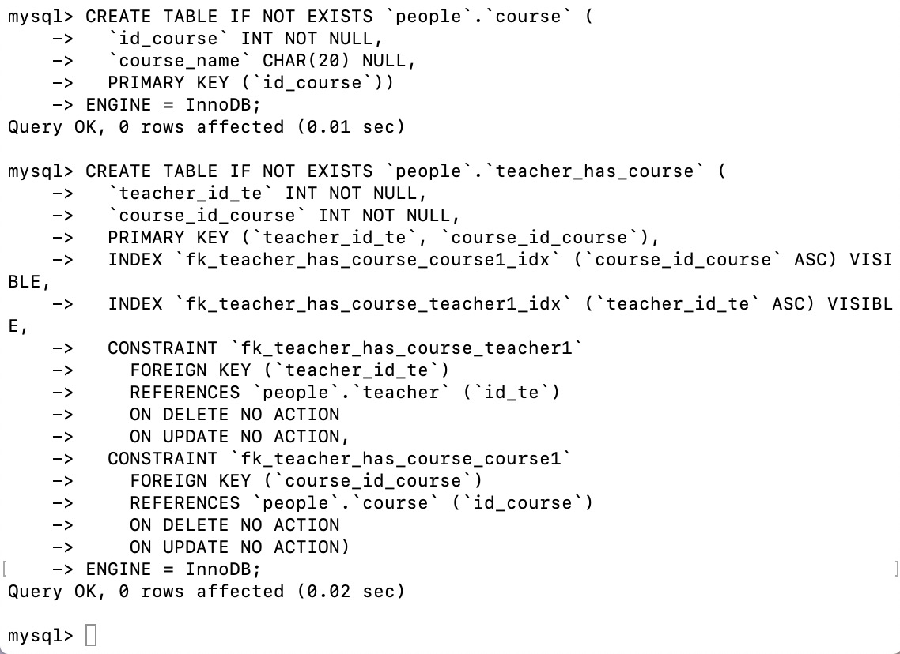
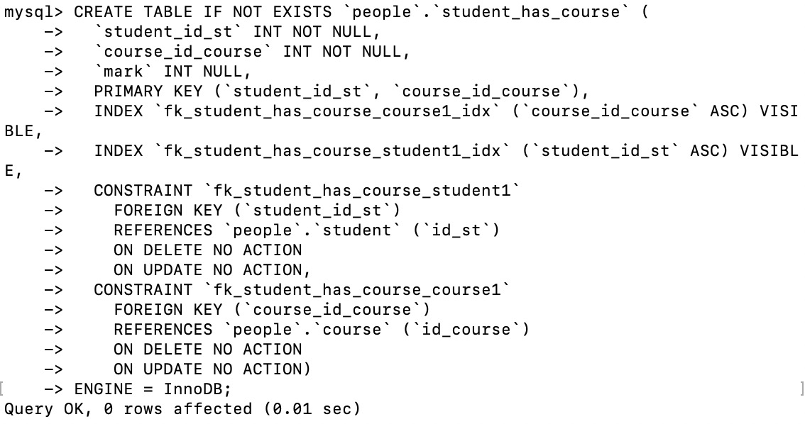
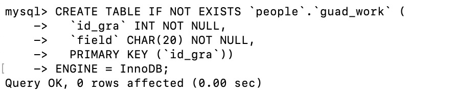
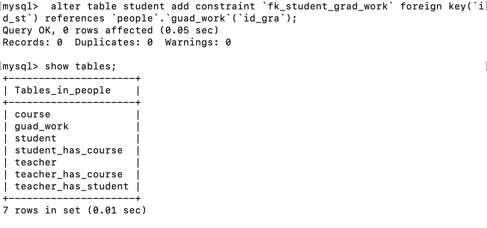

创建数据库people

创建数据表teacher和student

为student表中name属性添加索引

创建teacher和student的关系表，定义两个表的id为此关系表的两个外键

创建course表

创建teacher和course的关系表，定义两个表的id为此关系表的两个外键

创建student和course的关系表，定义两个表的id为此关系表的两个外键

创建guad_work表

将guad_work表的主键设为student表的外键

