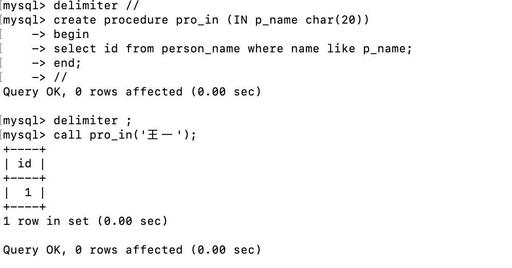
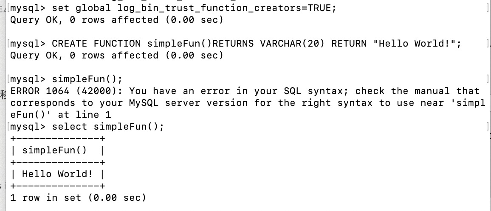
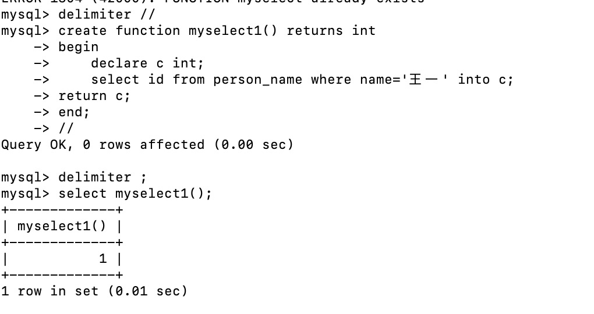
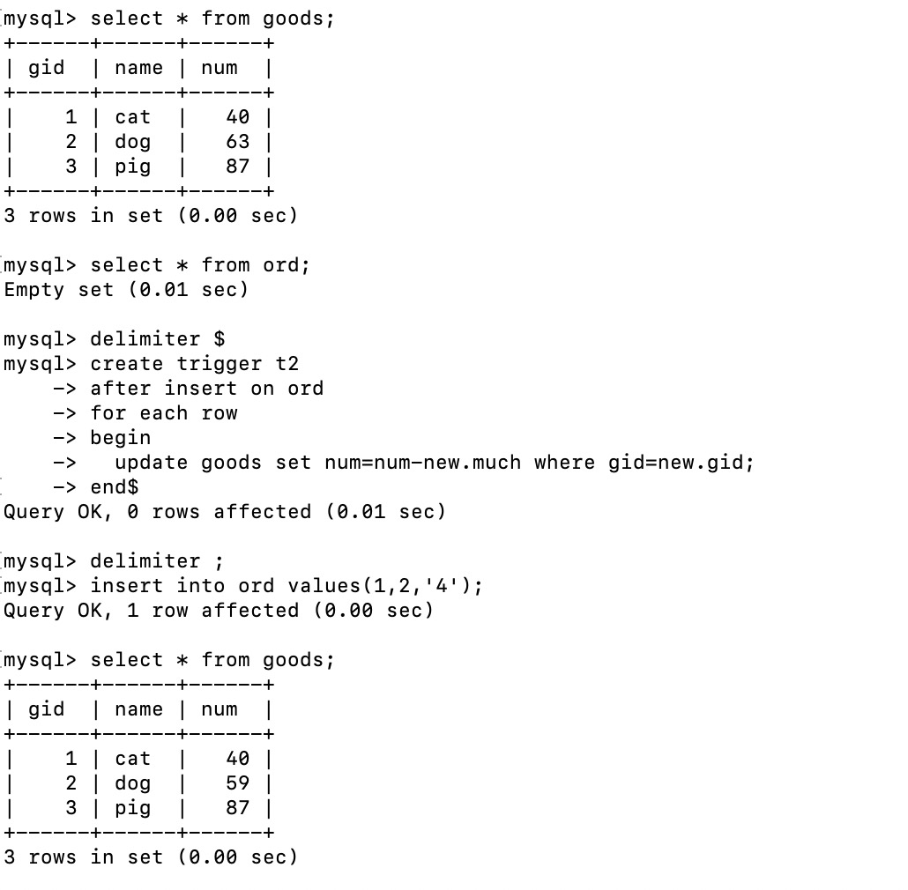

#### 存储过程的定义与调用

IN

#### 函数的定义与调用

#### 触发器的定义与调用

#### 适用场景：

存储过程：适用于基础数据访问人员多，对基础数据的安全性有要求；性能要求高、业务复杂的场景。

原因：存储过程的优点为简单、安全、高性能。通过把处理封装在易用单元中，可以简化复杂的操作；由于不需要反复建立一系列处理步骤，因而能保证数据的一致性，防止错误；简化了对变动的管理，限制对基础数据的访问，减少数据讹误的机会，保证了安全性；存储过程以编译过的形式存储，所以DBMS处理命令所需的工作量少，提高了性能。

函数：mysql内置很多基本的系统函数，方便直接调用获取返回值。自定义函数不常用。

原因：SQL函数是不可移植的，为了代码的可移植，许多 SQL 程序员不赞成使用特定于实现的功能。虽然这样做很有好处，但有的时候并不利于应用程序的性能。如果不使用这些函数，编写某些应用程序代码会很艰难。

触发器：基于某个表的变动在其他表上执行活动；进行额外的验证并根据需要回退数据；计算计算列的值或更新时间戳。

原因：因为触发器在特定的数据库活动发生时自动执行，可以与特定表上的 INSERT、UPDATE 和 DELETE 操作(或组合)相关联。

