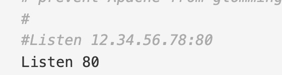
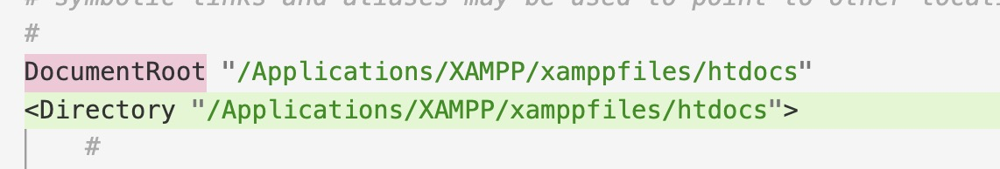
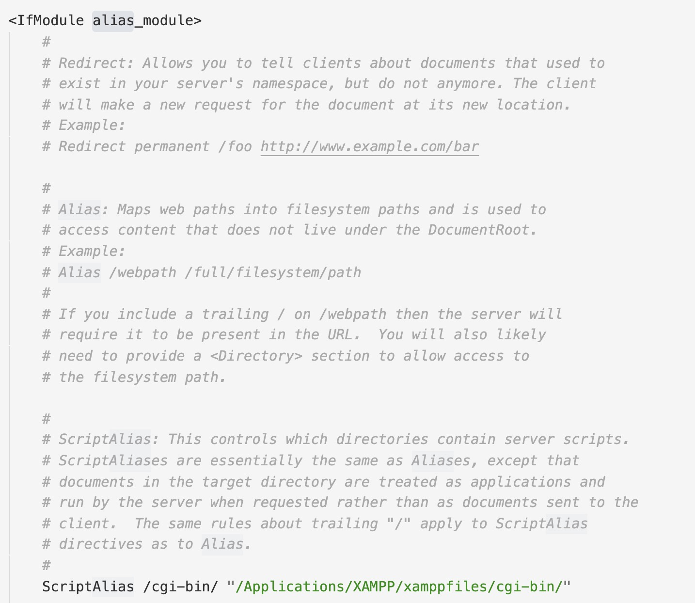
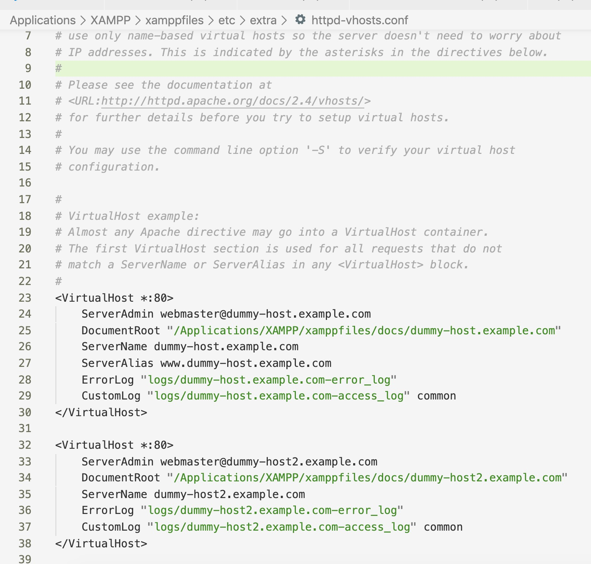

### Apache服务器配置文件httpd.conf (macOS, xampp)

#### 配置位置：

/Applications/XAMPP/xamppfiles/etc/original/httpd.conf

#### 端口号：

#### 文档根目录：

设置Web文档根目录。

语法：DocumentRoot directory-path

在没有使用类似Alias这样的指令的情况下，服务器会将请求中的URL附加到DocumentRoot后面以构成指向文档的路径。

如果directory-path不是绝对路径，则被假定为是相对于ServerRoot的路径。

指定DocumentRoot时不应包括最后的"/"。

#### 相对路径别名alias：

**Alias：**

映射URL到文件系统的特定区域。

语法：Alias URL-path file-path|directory-path

Alias指令使文档可以被存储在DocumentRoot以外的本地文件系统中。以(%已解码的)url-path路径开头的URL可以被映射到以directory-path开头的本地文件。

如果对在DocumentRoot之外的某个目录建立了一个Alias ，则可能需要通过<Directory>段明确的对目标目录设定访问权限。

**ScriptAlias：**

映射一个URL到文件系统并视之为CGI脚本目录。

语法：ScriptAlias URL-path file-path|directory-path

ScriptAlias指令的行为与Alias指令相同，但同时它又标明此目录中含有应该由cgi-script处理器处理的CGI脚本。以URL-path开头的(%已解码的)的URL会被映射到由第二个参数指定的具有完整路径名的本地文件系统中的脚本。

#### vhost配置：

